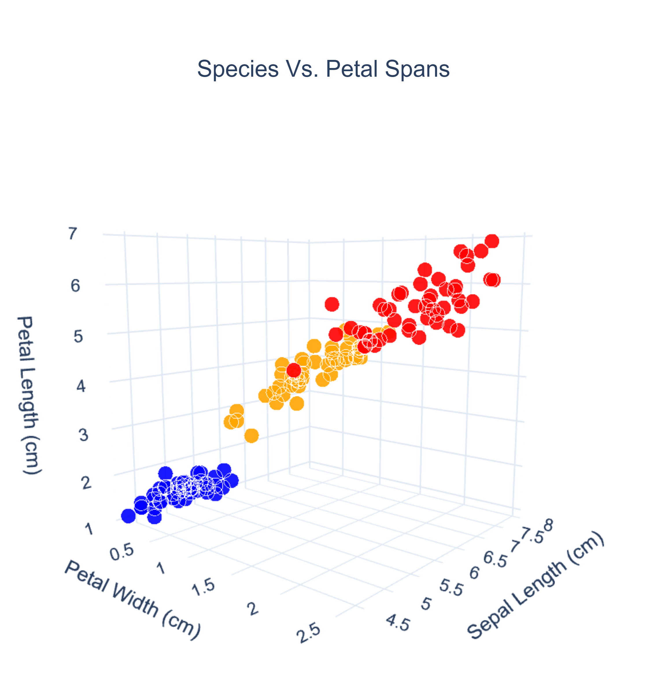

# Similarity Metrics

In this repository are stored a bunch of utilities for calculating the similarity between two datapoints

<!-- markdownlint-disable MD033 -->


## Applications

In many different use cases, embeddings are created, wherein complex data are mapped to vectors. The distances between these vectors are then used in decision-making (for example, finding k nearest neighbours).

This project should help the reader build an intuition to bridge the gap between geometric grounding and real-world utility.

## Usage

### Prerequisites

- `Python 3.x`
- `Jupyter Notebook` (or any Python IDE)

### Setup

1. Install dependencies with conda:

    ```bash
    conda env create -f environment.yml
    conda activate similarity-metrics
    ```

    (this will install the requirements specified in `environment.yml` in a local environment)

   Or with pip:

    ```bash
    pip install -r requirements.txt
    ```

    (this will install the requirements system-wide)
    To only add these packages into a venv, use:

    ```bash
    python -m venv venv
    source venv/bin/activate  # On Windows use `venv\Scripts\activate`
    pip install -r requirements.txt
    ```

2. Run the Jupyter notebook to see examples
    navigate to `demos/`

    ```bash
        cd demos
    ```

    ```bash
        jupyter [notebook]
    ```

3. Create your own distance visualizations using custom datasets: call `distance_matrix.py` with your dataset and desired metric.

## Features

### Metrics

#### 1. Euclidean Distance

The most commonly accepted formula for distance. Used in continuous geometry. Finds the continuous amount of space between two points. Given by the formula (in 2D):

$d = \sqrt{(x_2 - x_1)^2 + (y_2 - y_1)^2}$

Used in most of math.

#### 2. Manhattan Distance

Also known as taxicab or L1 distance. Measures the sum of absolute differences between coordinates, like navigating city blocks, most useful with sparse data:

$$
d = |x_2 - x_1| + |y_2 - y_1|
$$

For n-dimensional space:

$$
d = \sum_{i=1}^{n} |x_i - y_i|
$$

Bounded on $[-1, 1]$

Many AI-related applications. For example, it's a good heuristic in finding the shortest path to navigate through a maze. Also, it's more computationally efficient than Euclidean distance, but with similar functionality.

#### 3. Cosine Similarity

The scalar projection of one vector onto another, normalizing by their lengths. In other words, the cosine similarity measures the similarity of orientation alone. For example, this is very useful in NLP or recommendations.


Cosine similarity doesn't deal with 'distance' per se, but with direction. Still, it is a good measure of similarity and decision-making methods like kNN work just the same with cosine similarity.

$$
\text{similarity} = \cos(\theta) = \frac{\mathbf{A} \cdot \mathbf{B}}{\|\mathbf{A}\| \|\mathbf{B}\|} = \frac{\sum_{i=1}^{n} A_i B_i}{\sqrt{\sum_{i=1}^{n} A_i^2} \times \sqrt{\sum_{i=1}^{n} B_i^2}}
$$

This formula fuels search engines and match-making/similarity-ranking algorithms.

#### 4. Minkowski Distance

A generalization of Euclidean and Manhattan distances. More useful for real-life applications. For example, in creating paths for on a map, one would not travel in a perfectly straight line, nor perfectly horizontal/vertical steps.

$$
d_p = \left(\sum_{i=1}^{n} |x_i - y_i|^p\right)^{1/p}
$$

Where:

- $p = 1$: Manhattan distance
- $p = 2$: Euclidean distance  
- $p \to \infty$: Chebyshev distance (maximum difference), i.e. larger p gives more and more significance to the largest gap on any axis.

- Concretely speaking,
  If $p = 2$, that is like drawing a circle around one point and having the other point land on the circumference. This represents the most efficient possible path.
  If $p=3$, then we draw a more 'squarish' 'radius'.

- As $p$ increases, contours start squaring off along the axes. In 2D: circle becomes squarish with rounded corners; in nD, a hypercube-like shape

### 5. Gower Distance

A method of measuring the **dissimilarity** of two datapoints that contain mixed datatypes. The distance is noramlized between $0$ and $1$. $1$ is completely dissimilar and $0$ is identical.

The formula for this distance is as follows:

$$
d_G(a,b) = \frac
            {\sum_{i=1}^{n}s_i(a_i,b_i)}
            {\sum_{i=1}^{n} w_i}
$$

Where:

- $a = [a_1, a_2, \dots, a_n]$ and $b = [b_1, b_2, \dots, b_n]$ are the feature vectors of the two data points.

- $n$ is the number of datapoints

- $s_i(a_i,b_i)$ is the distance between two points, defined as:

$$
  s_i(a_i, b_i) =
  \begin{cases}
  \frac{|a_i - b_i|}{R_i} & \text{if feature } i \text{ is numeric} \\
  0 & \text{if feature } i \text{ is categorical and } a_i = b_i \\
  1 & \text{if feature } i \text{ is categorical and } a_i \neq b_i
  \end{cases}
$$

- $R_i = \max(X_i) - \min(X_i)$ = range of numeric feature $i$ across the dataset $X$.

- $w_i$ = weight of feature $i$: 1 if the feature is non-empty, 0 otherwise

### 6. Jaccard Distance

The Jaccard distance measures the dissimilarity of two sets. For example, set $A$ may have a Jaccard distance of 0 with itself, but a Jaccard distance of 1 with an empty set $B$.

Mathematically, the Jaccard distance is defined as:

$$
d_J(A, B) = 1 - \frac{|A \cap B|}{|A \cup B|}
$$

Where:

- $A$ and $B$ are sets
- $|A \cap B|$ is the size of the intersection of sets $A$ and $B$.
- $|A \cup B|$ is the size of the union of sets $A$ and $B$.

Some applications for Jaccard Distance include autocorrect systems, image recognition, and cases where finding overlapping patterns would be useful (for example, user segmentation or document clustering).

### Visualizations

In the `demos` folder, you will find different demonstrations of each of the different distances and their applications. Feel free to modify the data and interact with it as you see fit.


Some of the features of the demos include:

- Visualizing distance matrices using different metrics
- Comparing how different metrics behave on the same dataset
- Understanding the impact of different distance metrics on clustering and classification tasks
- Visualizing with scatter plots to compare.
